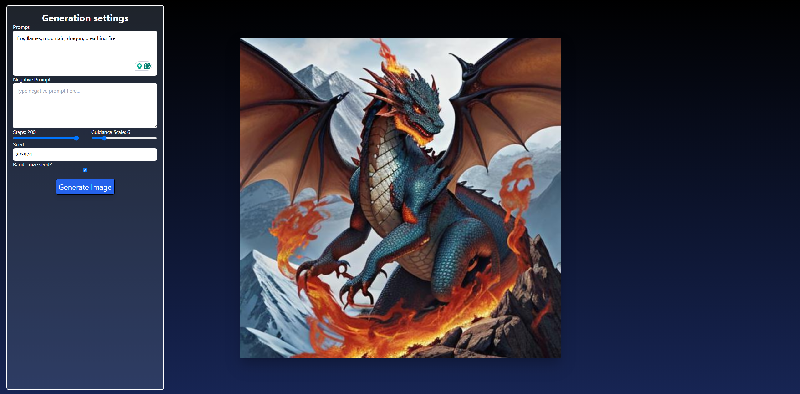

# Kraisd
 
Kraisd is a Stable Diffusion Web UI made for personal educational purposes. It currently supports text-to-image generation and basic configuration settings.


# Installation
Run git clone in your desired directory
```
git clone https://github.com/FPZKryddan/Kraisd.git
```

# Running

## Frontend
Install required packages:
```
cd frontend
npm install
```
Create a .env file and specify the url to the backend
```
VITE_BACKEND_URL = "<url>:<port>"
```
Finally run the front end!
```
npm run dev
```
Once it's up and running you can reach it on localhost:5173

## Backend
Create a local python environment and install the required dependencies.
```
python -m venv venv
./venv/scripts/activate
pip install -r requirements.txt
```
Once you got your environment running you can start the server:
```
py ./app.py
```
